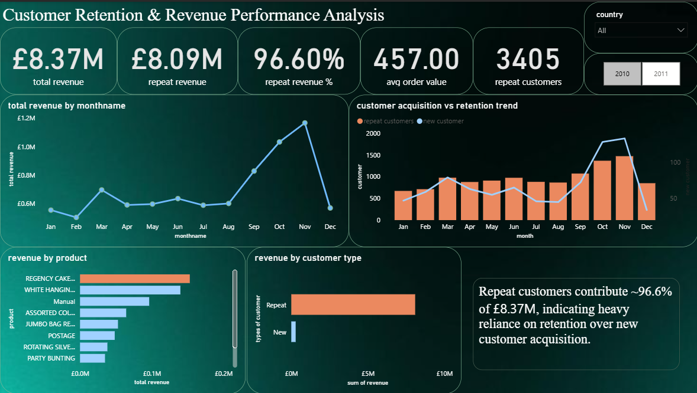

# Customer Retention & Revenue Performance Analysis

## Overview
This project analyzes customer retention, revenue trends, and product performance using the Online Retail II dataset. The objective of the project was to identify customer purchasing behavior, evaluate the contribution of repeat customers, and derive business insights through data analysis and visualization.

The project was developed using:
- Python for data cleaning and feature engineering
- PostgreSQL for analytical querying
- Power BI for dashboard visualization

---

## Business Problem
The project focuses on answering key business questions such as:

- How much revenue comes from repeat customers?
- How do customer acquisition and retention trends change over time?
- Which products contribute the highest revenue?
- Which countries generate the most sales?
- How dependent is the business on customer retention?

---

## Tools & Technologies
- Python
- Pandas
- PostgreSQL
- Power BI
- Jupyter Notebook

---

## Dataset
Dataset Used:
Online Retail II Dataset

The dataset contains transactional data for a UK-based online retail company between 2009 and 2011.

Dataset Source:
https://www.kaggle.com/datasets/mashlyn/online-retail-ii-uci

---

## Data Cleaning & Feature Engineering
The following preprocessing and transformation steps were performed using Python:

- Removed null Customer IDs
- Removed invalid and negative quantities
- Created Revenue column
- Extracted Year and Month fields
- Created Month Name column
- Classified customers into:
  - New Customers
  - Repeat Customers

---

## SQL Analysis
PostgreSQL was used to perform analytical queries including:

- Monthly revenue analysis
- Repeat customer revenue contribution
- Revenue by country
- Revenue by product
- Customer segmentation analysis
- Retention trend analysis

---

## Dashboard Features
The Power BI dashboard includes:

### KPI Cards
- Total Revenue
- Repeat Revenue %
- Average Order Value
- Repeat Customers

### Interactive Filters
- Year slicer
- Country slicer

### Visualizations
- Monthly Revenue Trend
- Revenue by Customer Type
- Customer Acquisition vs Retention Trend
- Revenue by Product
- Repeat Revenue by Product
- Revenue by Country

---

## Key Insights
- Repeat customers contributed approximately 96% of total revenue.
- Revenue increased during later months, indicating seasonal purchasing behavior.
- A small number of products generated a significant portion of overall revenue.
- Revenue was heavily concentrated in the United Kingdom market.
- The business showed strong dependence on customer retention.

---

## Business Recommendations
- Focus on customer retention and loyalty programs.
- Improve new customer acquisition strategies.
- Expand sales into international markets.
- Promote high-performing products using targeted campaigns.

---

## Project Structure

```text
Customer-Retention-Retail-Analysis/

├── dashboard/
│   ├── dashboard.png
│   └── customer_retention_dashboard.pbix
│
├── notebooks/
│   └── retail_cleaning.ipynb
│
├── sql/
│   └── retail_pgs.sql
│
└── README.md

```

---

## Dashboard Preview


---

## Author
Navya Singh
